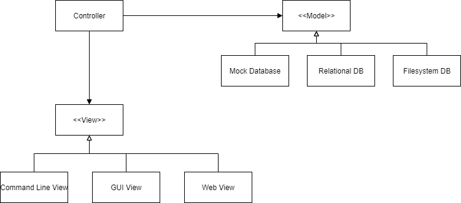

# Software Engineering Tips

I'm going to talk about a few things that I thought helped me become a better software engineer.
I'll hit a few points briefly, but most of this comes from *The Pragmatic Programmer* and *Clean Architecture*.
The former is a course textbook for CS 3110.

First let's discuss what I mean when I say module and component.
A module is often realized by a class in OOP languages.
You can think of it as a single unit of <u>independent</u> work.
The module includes everything it needs to be interchangeable and perform its desired functionality.
For example, I would consider the class `std::vector<T>` a module.
However, despite being their own class, I would consider the nested classes `std::vector<T>::iterator`
and `std::vector<T>::const_iterator` also to be part of the `std::vector` module.

A component, as Uncle Bob uses the term,
is an independently deployable unit of work one developer or developer team is responsible for.
A component would be like a library or compiled executable, such as a DLL, static library, JAR file,
Nuget package, ROS node, or EXE file. Ideally, developer teams can release updates to their components,
and other teams that depend on the components can choose when to upgrade to the newer version.
Components are independently compiled and linked, changes in one component have no immediate effect
on other components.


### DRY and ETC
From the Pragmatic Programmer.

This is probably the crux of good software engineering. Don't repeat yourself, and write code that's easy to change.
Unless you're refactoring code, every time you copy and paste something, ask yourself if there's a better way to do whatever it is you're doing.
Any bug in the copied code leads to bugs everywhere you paste that code. Furthermore, making a change to pasted code
requires making a change to all other copies. Not only should you not repeat yourself in code, but you shouldn't
repeat yourself in comments either.

We also want to strive to make our code easy to change. Refactoring should be relatively painless. We can't see the future, so
let's avoid casting any decision in stone. In fact, delay making decisions that constrains the code until as late as possible.
Can you develop almost an entire application without deciding what UI framework to use, or even if you want to develop a desktop or web app?

### Gardening, not Construction

Often time developing a program is given the analogy of construction, but Uncle Bob (I think) points out that gardening is a better analogy.
When you build a house, you plan it out in detail ahead of time, execute that plan, and then kind of move on. The house might need maintenance here and there every
so often, but often nothing extensive. Gardening is something that the gardener never walks away from. There's weeding, fertilizing, watering,
and probably a bunch of other stuff I don't know about since I'm not a gardener. Refactoring isn't like ripping apart the foundation,
and rebuilding a house, it should be like weeding, done continually as you go along. Even if you're not unit testing a module or function, still
think "Red"-"Green"-"Refactor".

### Small Functions and the Art of Naming

Small functions essentially allows us to name sections of code. Names for modules and functions should be short, and describe more or
less everything that it's doing. Use names like comments, they can help us understand what's going on in the code. Most importantly
however, don't make a liar out of the code. If the function of something changes to no longer match its name, change the name.

### SRP

Single Responsibility Principle

A module should have one responsibility, what does that mean, well it means one and only one reason to change.
It should be responsible for one actor, or stakeholder. Consider an Employee module with the methods
`calculatePay()`, `reportHours()`, and `saveVPNUsage()`. `calculatePay()` might be handled by Accounting,
`reportHours()` by HR, and `saveVPNUsage()` by IT. If HR decides to change how it manages clocking in and out,
accounting's `calculatePay` should not be affected.

Other things that might indicate an SRP violation include merge conflicts and the "Monday Morning Syndrome".
The latter is when you come back to code that was working fine the last time you touched it, but is now
broken since someone else made some other change. The name comes from the idea that you come back Monday morning
to broken code that was working when you left for the weekend Friday afternoon.

### OCP

Open Close Principle

A module should be open for extension but closed for modification. Ideally, a module's behavior can be extended to and changed
without modifying the actual module. In OOP, this often looks like inheritance and subtyping, however another form of this is to
have the module take callable objects as input.

Imagine that you display negative numbers in an online spreadsheet in red. Now someone wants to print the spreadsheet in black and white.
How much code would change to do something else, like display negative numbers in bold-face? Ideally, no code will need to change,
and you just need to add code.

We can create a class hierarchy based on the notion of "level". The highest level modules, are the most protected from change.
A module of a higher level is normally a module that is further away from the inputs and outputs of the program, normally a
more abstract module, and normally a module that contains "business logic". Business logic can be seen as the crux of what your application does.
If module `A` should be protected from change from module `B`, then `B` should depend on `A`.

### LSP

Liskov Substitution Principle

Everything should be substitutable like interchangeable parts. This roughly boils down to programming to an interface, and not an implementation.
What this means is that a client should control an implementation through an abstract interface. Furthermore, the client should not know or care what
the actual concrete implementation that they are using is.

### ISP

Interface Segregation Principle

Don't depend on things you don't need. In C++, we can PIMPL compiler firewalls and forward declarations.
Let's take the following `foo.h`as an example:

```C++
#include "Bar.h"
#include "Person.h"
#include "Fizz.h"
class Foo {
    Fizz fizz;
    Bar bar;
    Namespace::Person person;
public:
    Namespace::Person fooPerson(const Bar & bar);
    
};
```
A person who just wants to use `Foo` also depends on `Fizz`, `Person`, and `Bar`. If one of these modules
has a change to their interface, the client's code will have to be recompiled even though they only use
`Foo`!

We can change this to the following:

```C++
#include <memory>
namespace Namespace { class Person; }
class Bar;

class Foo {
    struct Impl;
    std::shared_ptr<Impl> pimpl;
public:
    Foo();
    ~Foo();
    class Namespace::Person fooPerson(const class Bar & bar);
};
```

Now the client of `Foo` is doesn't depend on Foo's dependencies.

Furthermore, consider a module with three operations. If a client only wants to use one of these three,
then they'll have to depend on the entire module. So a client will be affected by changes to operations
it doesn't even use!

The parts that make up a module should be inseparable. This also ties into SRP.

### DIP

Dependency Inversion Principle

The flow of control in a program should go opposite the dependencies in the program. This inversion is achieved by
interfaces. Consider this simple and generic application architecture:



Notice that the flow of control begins at the View, goes to the Controller, and ends at the Model. Then it returns from the Model, through the Controller,
and back to the View. However, the dependencies go from the Controller to the View and Model. Because the Controller depends on the View and Model,
it is protected from changes in these modules. The idea is to make external logic a plugin, and easily changeable. In this example,
the controller would be the highest level, because it is furthest from inputs and outputs, and would contain the "business logic".
Business logic includes your IPs (intellectual property), and generally embody the "point"/"purpose" of the application.
We want our business logic to be protected from changes in the view and data model. Thus, it should depend on these things and not the other way around.
In C++, a main function for this application might look something like this:

```C++
int main() {
    View v = makeView(/*...*/); 
    // factory function so we don't know what implementation is used
    Model m = makeModel(/*...*/);
    Controller controller(v, m);
    // ...
}
```

Uncle Bob says that **nothing concrete** should be depended on. That means that a client should always use the name of the interface and
a client should never `#include` the header of a concrete implementation.


### No Broken Windows

They say a building with broken windows leads to a sense of abandonment and lack of care in the inhabitants. The same mentality applies to code.
We should never think "eh, that's fine, the rest of the code is a mess anyway". Refactor as you go and whenever you make a change,
strive to leave the code just a little cleaner than how you found it. It doesn't have to be big, maybe just a single variable name change or splitting
up one large function into two smaller ones. At the very least, comment the bad code with a `TODO`, but make sure you actually get back to it.

### Stability

Stability is a module or component's effort required to make a change. Think of it like inertia. The more things depend on a module,
the harder it is to change, and the more stable it is. A component should depend only on more stable components. Roughly speaking, 
abstractions and interfaces should be the most stable so that its stability doesn't inhibit modifications.
Concrete classes should be the least stable, so they can change easily. This goes back to the advice of DIP: nothing concrete should be depended upon.


### Humble Object and Testing to an Interface

Uncle Bob's Humble Object design pattern is when you use ability to test as a criteria for separating different parts of a module or component.
The idea is to split a module, into two smaller modules; one is easy to test, and one is hard to. This relates to the idea of testing to an interface
and not an implementation. An implementation may have tons of helper functions, since they are not exposed to the interface, they shouldn't be directly tested
to keep the test code as easy to change as production.

### Engineering Daybook
From Pragmatic Programmer

Maybe you aren't as forgetful as I am, but I have found that it's pretty easy to forget the details of what I was working on last week.
Moreover, I have found it's quite annoying to be 5 levels deep in the debugger only to be interrupted and forget where I was.
An engineering "day"-book is a way to help with this. Now I admittedly suck at the whole "day" part of daybook as I'm on the same one 
as when I started a year ago, but the idea is to write down notes, reminders, etc. every day. You can use it for keeping track of where
you are in your debugging, scrap paper for calculations, or just rubber ducking. Rubber ducking is explaining, in detail, what your code that
you're debugging does as the mere act of explaining it to someone (or something) that has never seen it before can help you find
things you missed.

### Boundaries

We can decouple code simply by having separate functions. Later we may find that we need separate modules or separate components.
We can create stronger boundaries by creating different deployment components, separating code to run on independent threads, independent processes, 
or even independent services connected remotely. Stronger boundaries strengthens decoupling but increases the cost of crossing the boundary.

### Defensive Programming

Always be on the look out for "impossible" program states. Act like there is a little gremlin in your code that's trying to mess you up.
For example, maybe in a switch block the default case should never be executed. Instead of just leaving it out, knowing the default
case should never be chosen, make the default case throw an exception.

Make your interfaces really easy to use and hard to mess up. Finally, document everything you are assuming. It might be hard to notice things
you are subconsciously assuming, but whenever you can see an assumption made in your code, document it. For example,
if you use any of the C string functions on a `const char *`, you are assuming that `const char *` is a C string, which
ends in the null terminator.

## Examples